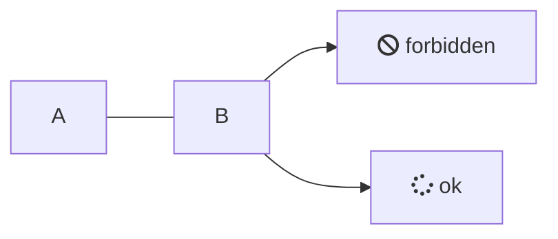
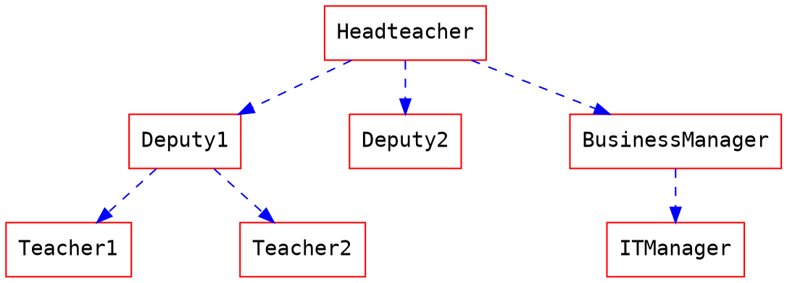

# markdown 部分
---
# 标题（Headings） {#headings}
# Heading level 1
## Heading level 2
### Heading level 3
#### Heading level 4
##### Heading level 5
###### Heading level 6

## 可选语法 {#headings-option}
Heading level 1
===============
Heading level 2
---------------
> 部分浏览器 h1 和h2的字体大小相同

# 段落（Paragraphs）
使用空白行将一行或多行文本进行分隔。
> 部分解析器不需要空白行

## 换行（Line Breaks）
在一行的末尾添加两个或多个空格，然后按回车键（return），即可创建一个换行（line break） (\&lt;br\&gt;)。

# 强调（Emphasis）
## 粗体（Bold）
在单词或短语的前后各添加：
- 粗体 两个星号（**asterisks**）或下划线（ __underscores__ ）
- 斜体 一个星号（*asterisks*）或下划线（ _underscores_ ）
- 粗斜体 三个星号（***asterisks***）或下划线（ ___underscores___ ）

> 如果和其他相连时，需要使用星号。

# 块引用（Blockquotes）
> 引用
>> 嵌套引用

# 列表（Lists）
1. 使用数字和英文句号开头
2. 数字可以不连续
3. 数字也可以相同
4. 其他

- 使用横线（-），星号（*），加号（+）
- 但不要混合使用
- 1949\. 特殊情况

> 如果无序列表以数字开头并且数字后紧接英文句号，需要使用反斜线(\\)将句号转义

- 多行内容
  第二行
- 为了保持列表连续，如果内容有多行时，需要添加4个空格（部分解析器两个）或者一个tab
    <html>
      <head>
        <title>Test</title>
      </head>
    </html>
- 嵌入代码块需要添加8个空格或者两个tab。
  
- 图片和多行相似，需要添加4个空格或者一个tab

# 代码
行内代码，使用一个反引号（\`）包裹。`code`
如果代码内有反引号，使用两个反引号包裹。`` `code` with backquot``，但不要三个连一起

    代码块使用4个空格或者一个tab做缩进
    并确保代码块前后各有一个空行
    或者使用围栏式代码

```
围栏式代码块
使用三个反引号，或者三个波浪线，前后各使用一行包裹代码块
优点是可以减少缩进
```

# 表格（Tables）

|align left|align center| align right|
|:---|:---:|---:|
|1||\$160|
|3|>|\$12|
|5|6||
|^|7|\$1|

# 任务列表（Task Lists）

- [x] meta传递数据
- [x] 设置和默认配置
- [x] 表单解析和快捷提交
- [x] 302跳转控制
- [ ] 任务队列（内存:heavy_check_mark:，redis:heavy_check_mark:，mongodb）
- [ ] 数据统计
- [x] ~~多线程~~，使用curlmulti
- [x] 针对相同域名的延时请求
- [ ] ~~pipe item~~，太麻烦，不支持

# 图表




# emoj
可以去这里复制 [emojipedia](https://emojipedia.org/random/)

# slide
暂时选定[impress.js](https://github.com/impress/impress.js)

# katex 部分
---
行内代码$ x $

$$ e^{i \pi} + 1 = 0. $$
$$ \frac{k^3}{2} - k^2 + ck - 1 = 0 $$

$$ \begin{aligned}
e^{i \pi} + 1 &= 0. \\
e^{ix} &= \cos x + i \sin x.
\end{aligned}
$$
> 公式对齐和换行

$$\begin{array}{c}
\nabla \times \vec{\mathbf{B}} -\, \frac1c\, \frac{\partial\vec{\mathbf{E}}}{\partial t} &
= \frac{4\pi}{c}\vec{\mathbf{j}}	\nabla \cdot \vec{\mathbf{E}} & = 4 \pi \rho \\\\
\nabla \times \vec{\mathbf{E}}\, +\, \frac1c\, \frac{\partial\vec{\mathbf{B}}}{\partial t} & = \vec{\mathbf{0}} \\\\
\nabla \cdot \vec{\mathbf{B}} & = 0
\end{array}$$
> 分组对齐和换行

$$
\frac{\partial ^{2} T}{\partial x^{2}}
\frac{ y^{'} }{ x^{'} }
$$
$$
\begin{equation}
\tag{1.5} (x^n){'} = n * x ^{n-1}
\end{equation}
$$
$$
\begin{equation}
\begin{split}
\frac{ y^{'} }{ x^{'} } \\
(x^n){'} = n * x ^{n-1} \\
\frac{\partial ^{2} T}{\partial x^{2}} = 1
\end{split}
\end{equation}
$$

$$
\begin{align}
\frac{\partial ^{2} T}{\partial x^{2}} = 1 \\
\frac{ y^{'} }{ x^{'} }
\end{align}
$$


# 自定义扩展部分
---
### 注脚

这是一个注脚[^注脚1]

[^注脚1]: 这里显示一段话